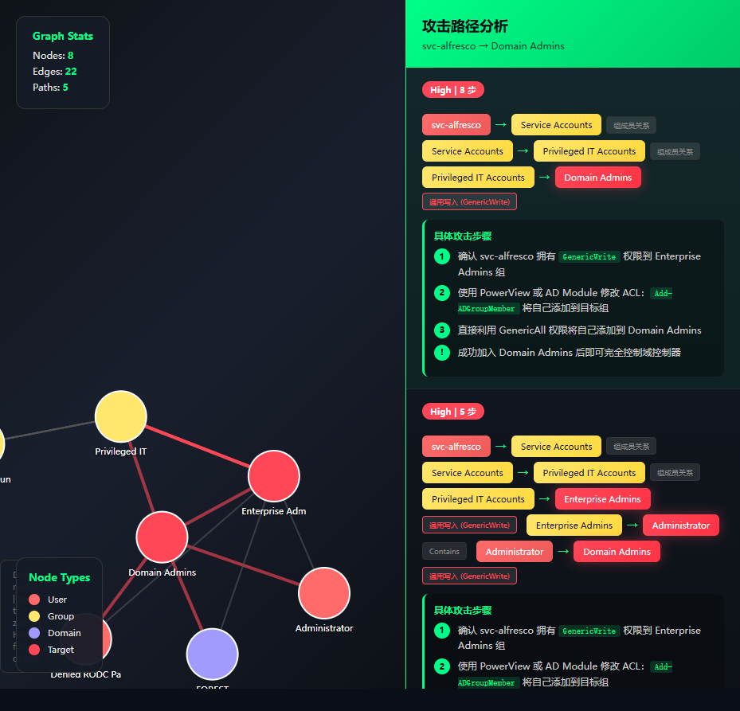

# 🩸 BloodHound Analyzer

<div align="center">


**自动化 BloodHound AD 数据分析工具 | 真实靶场实战验证 (如 HTB Forest) | 攻击路径动态推演 | 自动安全评估**

[功能](#-功能特性) • [快速开始](#-快速开始) • [使用方法](#-使用方法) • [示例](#-示例) • [截图](#-效果预览)

</div>

---

## 🔥 功能特性

<div align="center">

| 功能 | 描述 |
|:---:|:---|
| 🔍 **自动分析** | 加载 BloodHound JSON 数据，自动构建关系图 |
| ⚔️ **全景攻击路径推演** | 基于真实域环境（如 **HTB Forest** 等靶场环境实测效果极佳），生成带有风险评级与详细手法的全景攻击链路 |
| 📊 **动态可视化** | D3.js 力导向交互图，节点可拖拽、缩放，并实时对应出具体的横向移动与提权攻击手法（如 `GenericAll`, `Shadow Credentials` 等） |
| 🔐 **安全评估** | 自动识别各类复杂攻击向量并生成安全评级 |
| 📝 **报告生成** | Markdown 安全报告，高度本土化的中文攻击链解析 |

</div>

---

## 🚀 快速开始

### 安装

```bash
git clone https://github.com/yourusername/bloodhound-analyzer.git
cd bloodhound-analyzer
pip install -r requirements.txt
```

### 准备数据

将 BloodHound 采集的 JSON 文件放入目录：

```
your_data/
├── users.json
├── groups.json
├── computers.json
└── domains.json
```

### 命令行使用

```bash
# 查看域统计
python scripts/analyze.py C:\data\BloodHoundData stats

# 查询用户
python scripts/analyze.py C:\data\BloodHoundData user svc-alfresco

# 查找攻击路径
python scripts/analyze.py C:\data\BloodHoundData path svc-alfresco "Domain Admins"

# 发现特权账户
python scripts/analyze.py C:\data\BloodHoundData privileged

# 生成可视化
python scripts/analyze.py C:\data\BloodHoundData visualize
```

---

## 📖 使用方法

### Python 模块使用

```python
import sys
sys.path.insert(0, '.')
from src.analyzer.core import BloodHoundAnalyzer

# 初始化
analyzer = BloodHoundAnalyzer(r'C:\data\BloodHoundData')
analyzer.load()

# 查询用户
user_info = analyzer.query_user('svc-alfresco')
print(user_info['sid'])
print(user_info['summary'])

# 查找攻击路径
paths = analyzer.find_all_paths('svc-alfresco', 'Domain Admins', max_hops=5)

# 生成可视化
from src.analyzer.visualizer import VisualizationGenerator
viz = VisualizationGenerator(analyzer)
html = viz.generate_attack_path_html(paths['paths'])
```

### 攻击类型识别

| 图标 | 攻击类型 | 风险 |
|:---:|:---|:---:|
| 💀 | ASREP Roasting | High |
| 🔥 | Kerberoasting | High |
| ⛓️ | GenericWrite/All | Critical |
| 🔑 | 无约束委派 | Critical |

---

## 🎯 示例

### 攻击路径示例

```
svc-alfresco (ASREP Roastable)
    ├── MemberOf → Service Accounts
    │   └── GenericWrite → Enterprise Admins
    │       └── Contains → Domain Admins
    │
    └── GenericWrite → Domain Admins
```

### 生成的安全报告

```markdown
# Active Directory 安全评估报告

## ASREP Roastable 用户
- svc-alfresco (密码永不过期，高风险)

## 高风险路径
- svc-alfresco → Domain Admins (GenericWrite)

## 建议
1. 禁用 ASREP Roasting
2. 审查 Service Accounts 组成员
3. 限制 GenericWrite 权限
```

---

## 🎨 效果预览

### HTB 真实 AD 域环境实测

动态交互式全景攻击链路 (基于 `svc-alfresco -> Domain Admins` 路径发现)，涵盖了特权路径(`Shadow Credentials`, `GenericWrite` 等) 的逐步解析与风险标识：

<div align="center">
  
</div>

---

### 交互式攻击路径图


*节点可拖拽 | 滚轮缩放 | 悬停查看详情*

</div>

### 命令行输出

```
[*] 加载 BloodHound 数据...
[*] 构建关系图...
[*] 查找攻击路径...

=== 攻击路径分析 ===

🔴 High Risk | 3 步

svc-alfresco → Service Accounts [MemberOf]
    ↓
Service Accounts → Enterprise Admins [GenericWrite]
    ↓
Enterprise Admins → Domain Admins [Contains]

⚡ 攻击方法: ASREP Roasting + ACL Abuse
```

---

## 📁 项目结构

```
bloodhound/
├── src/
│   └── analyzer/
│       ├── core.py            # 核心分析引擎
│       ├── data_loader.py     # 数据加载
│       ├── graph_builder.py   # 图构建
│       ├── acl_analyzer.py    # ACL 分析
│       ├── attack_explainer.py # 攻击解释
│       └── visualizer.py      # 可视化生成
├── scripts/
│   └── analyze.py             # 命令行入口
├── d3.min.js                  # D3.js 库
├── requirements.txt
└── README.md
```

---

## ⚙️ 配置

### 修改数据目录

在 `scripts/analyze.py` 中：

```python
DATA_DIR = r"C:\your\data\path"
```

或通过命令行指定：

```bash
python scripts/analyze.py /path/to/data stats
```

---

## 🤝 贡献

欢迎提交 Issue 和 Pull Request！

## 📄 许可证

MIT License - 自由使用、修改、分发

---

<div align="center">

**Made with ❤️ for Red Team Operations**

</div>